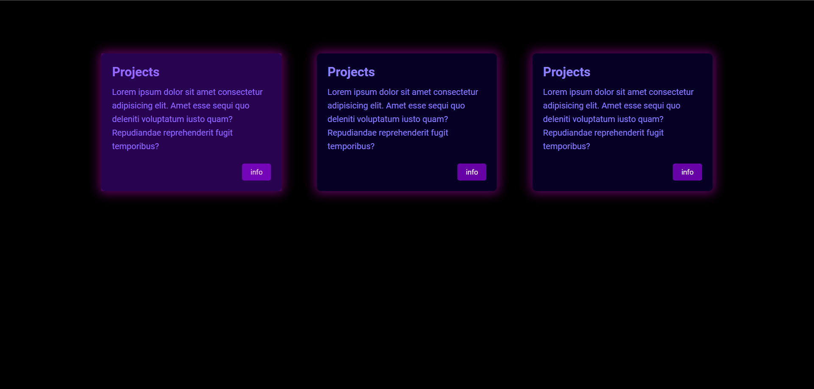

This is a simple card project created using HTML, CSS and basic JS. It provides a straightforward card component with a simple hover effects.

## Features

- Minimalistic design for ease of use.
- Input fields for username/email and password.
- Responsive layout that adapts to different screen sizes.
